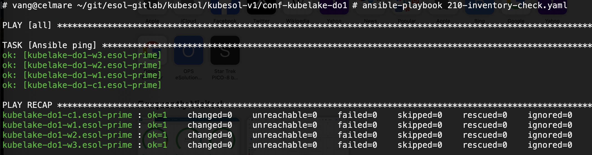
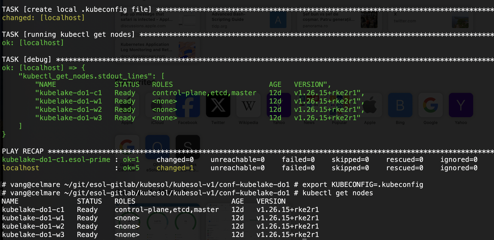

# To use an existing cluster

0. read and [setup your machine](../admin-machine-setup.md)

1. Clone the git repo (this means you will need access). 

2. cd into a config directory and copy/link ansible files in there. For example:

```
cd <YOUR CONFIG DIRECTORY>
# this is a folder where you have at least those files: Inventory, ansible.cfg

# link 
# or copy all ansible files from the project. rsync -a ../ansible/ ./
ln -s ../ansible/* .
```

3. Check the `Inventory` file and make sure you can access all hosts with ssh (required for Ansible). Run:

```
ansible-playbook 210-inventory-check.yaml 
```

You should see something like this:



4. Get and use the kubeconfig file. For example:

```
  rm .kubeconfig         # remove this file if it exists
  ansible-playbook 320-get-kubeconfig.yaml  # create .kubeconfig file

  export KUBECONFIG=.kubeconfig  # prepare to use this file
  kubectl get nodes              # run kubectl or helm normally
```

You should see something like this:



5. See also [accessing web interfaces](accessing-web-interfaces.md).

