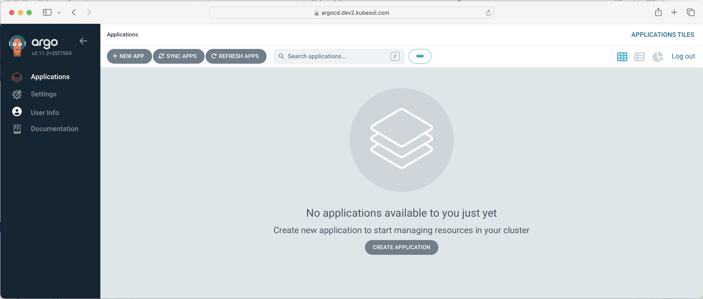

# ArgoCD

ArgoCD is a declarative, GitOps continuous delivery tool for Kubernetes (the "CD" part in CI/CD). 
Read more at:

- https://argo-cd.readthedocs.io/en/stable/
- https://github.com/argoproj/argo-cd

## Install

To check it: 

```
$ kubectl -n argocd get pods
NAME                                                READY   STATUS      RESTARTS   AGE
argocd-application-controller-0                     1/1     Running     0          29m
argocd-applicationset-controller-7699df9c8d-8q8fk   1/1     Running     0          29m
argocd-dex-server-555fcbb756-vnbps                  1/1     Running     0          29m
argocd-notifications-controller-775ccf78db-bf9g6    1/1     Running     0          29m
argocd-redis-ha-haproxy-77f458b466-98z75            1/1     Running     0          29m
argocd-redis-ha-haproxy-77f458b466-bzb8m            1/1     Running     0          29m
argocd-redis-ha-haproxy-77f458b466-wclbl            1/1     Running     0          29m
argocd-redis-ha-server-0                            3/3     Running     0          29m
argocd-redis-ha-server-1                            3/3     Running     0          28m
argocd-redis-ha-server-2                            3/3     Running     0          27m
argocd-redis-secret-init-dzxrz                      0/1     Completed   0          30m
argocd-repo-server-5bcc75f956-rncjk                 1/1     Running     0          29m
argocd-server-5bdd5f46fd-cjjvv                      1/1     Running     0          29m
```

To install it: `ansible-playbook 500-argocd.yaml`

## Web interface
To access the web interface:

```
# retrieve the initial admin password
kubectl -n argocd get secret argocd-initial-admin-secret -o jsonpath="{.data.password}" | base64 -d ; echo

# get the access URL
kubectl -n argocd get ingress
```

Alternatively, the web interface can be accessed with port forwarding:

```
kubectl port-forward service/argocd-server -n argocd 8080:443
# open the browser on http://localhost:8080 and accept the certificate
```



## Usage

ArgoCD is installed but unconfigured. You can configure it with the web interface or with the declarative method described in the official documentation https://argo-cd.readthedocs.io/en/stable/operator-manual/declarative-setup/ .


