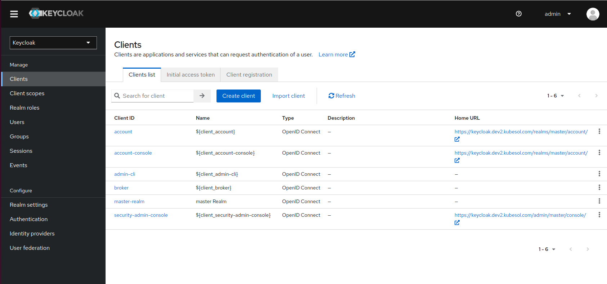

# Keycloak

Keycloak is an identity and access management solution for applications and services.

Official URLs for Keycloak: 
 
- https://www.keycloak.org/  
- https://www.keycloak.org/documentation  
- https://github.com/keycloak/keycloak  

## Install

In our setup it requires CNPG (Postgres operator) which, in turn, uses the default storage class (Longhorn).

To check it: 

```
$ kubectl -n keycloak get pods
NAME                    READY   STATUS    RESTARTS   AGE
keycloak-0              1/1     Running   0          19m
keycloak-pg-cluster-1   1/1     Running   0          23m
keycloak-pg-cluster-2   1/1     Running   0          21m
```

To install it: `ansible-playbook 445-keycloak.yaml`

## Keycloak web interface

To use the keycloak web interface. The URL is something like `https://keycloak.<<ext_dns_name>>`, 
you can get the exact address with `kubectl -n keycloak get ingress`.

Retrieve the first admin password with:

```
kubectl get secret --namespace keycloak keycloak -o jsonpath="{.data.admin-password}" | base64 -d
```


