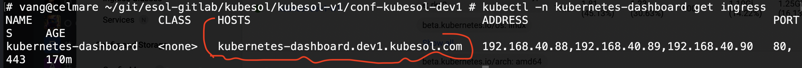

# Kubernetes dashboard

Kubernetes dashboard is a web-based Kubernetes interface. 

It is part of the official Kubernetes project: https://kubernetes.io/docs/tasks/access-application-cluster/web-ui-dashboard/ . 

## To access web interface

Get the token with this command:

```
  kubectl get secret admin-user -n kubernetes-dashboard -o jsonpath={.data.token} | base64 -d ; echo
```

If you deployed the ingress, use `https://kubernetes-dashboard.<<ext_dns_name>>`. You can get the exact address with `kubectl -n kubernetes-dashboard get ingress`:




Otherwise:

```
  kubectl -n kubernetes-dashboard port-forward svc/kubernetes-dashboard-kong-proxy 8443:443
  # open browser, accept SSL warning at https://localhost:8443
```

