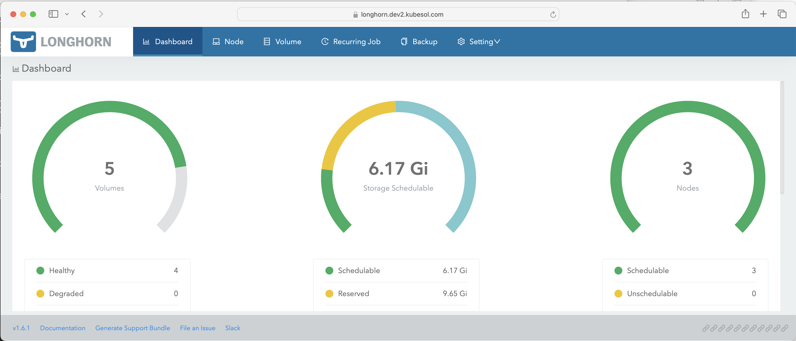

# Longhorn storage

Lonhorn is a Kubernetes storage system. Read more at https://github.com/longhorn/longhorn
and https://longhorn.io/docs/ .

We are using it as the default storage class and it is required by many other components for PVCs.

## Install

To check it: 

```
$ kubectl -n longhorn-system get pods
NAME                                                READY   STATUS    RESTARTS   AGE
csi-attacher-5579f877b5-2tsqw                       1/1     Running   0          16h
csi-attacher-5579f877b5-9jltj                       1/1     Running   0          16h
csi-attacher-5579f877b5-wcd9b                       1/1     Running   0          16h
csi-provisioner-85c666b879-btkcp                    1/1     Running   0          16h
csi-provisioner-85c666b879-k8mhw                    1/1     Running   0          16h
csi-provisioner-85c666b879-xbr6c                    1/1     Running   0          16h
csi-resizer-5dc4d54cb7-8x48g                        1/1     Running   0          16h
csi-resizer-5dc4d54cb7-nhv5d                        1/1     Running   0          16h
csi-resizer-5dc4d54cb7-wvbwt                        1/1     Running   0          16h
csi-snapshotter-7cd5568c6d-bfqzv                    1/1     Running   0          16h
csi-snapshotter-7cd5568c6d-hsvws                    1/1     Running   0          16h
csi-snapshotter-7cd5568c6d-zmmpz                    1/1     Running   0          16h
engine-image-ei-b0369a5d-4rprc                      1/1     Running   0          16h
engine-image-ei-b0369a5d-k5jgk                      1/1     Running   0          16h
engine-image-ei-b0369a5d-rcgms                      1/1     Running   0          16h
instance-manager-1cdbfd29a139da31e1a80422461942c3   1/1     Running   0          16h
instance-manager-3e535b068bd2e47bf365b1c9323e0d67   1/1     Running   0          16h
instance-manager-3f47b60bba27c7287f699d459778e6ac   1/1     Running   0          16h
longhorn-csi-plugin-6r2sn                           3/3     Running   0          16h
longhorn-csi-plugin-85hz9                           3/3     Running   0          16h
longhorn-csi-plugin-xhjds                           3/3     Running   0          16h
longhorn-driver-deployer-68cb9bf546-n4k9g           1/1     Running   0          16h
longhorn-manager-kxfbz                              1/1     Running   0          16h
longhorn-manager-sflxv                              1/1     Running   0          16h
longhorn-manager-xzqm4                              1/1     Running   0          16h
longhorn-ui-585bb57bf4-6vdh8                        1/1     Running   0          16h
longhorn-ui-585bb57bf4-dtpk8                        1/1     Running   0          16h
```

To install it:

```
ansible-playbook 410-longhorn-prep.yaml 
ansible-playbook 411-longhorn-helm.yaml  
ansible-playbook 412-longhorn-web.yaml 
```

## Longhorn web-interface

The URL is something like `https://longhorn.<<ext_dns_name>>`, 
you can get the exact address with:
```
kubectl -n longhorn-system get ingress
```

Retrieve the admin password with:

```
ansible-playbook 412-longhorn-web.yaml
```




