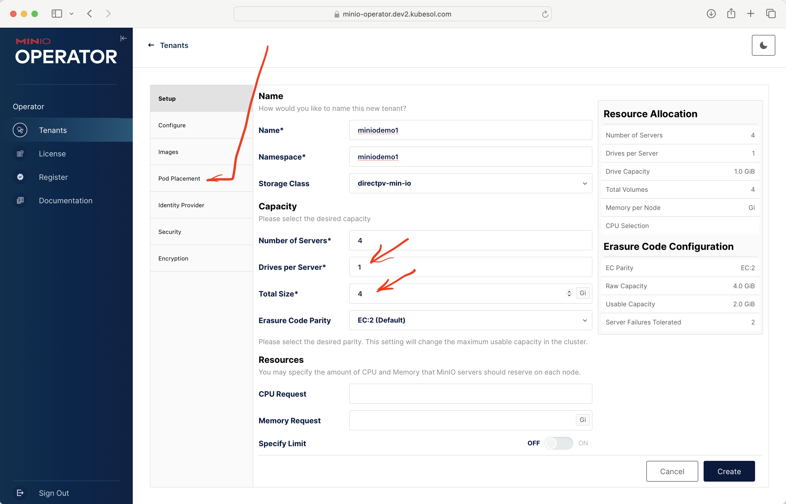
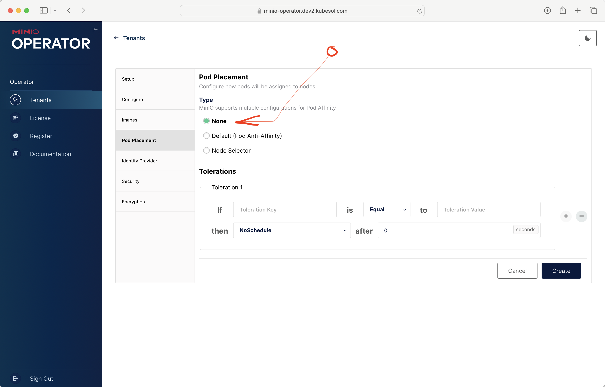

# Minio

MinIO is a S3 compatible object store. See more at https://min.io and https://min.io/docs/minio/kubernetes/upstream/

## Install

Minio will require DirectPV!

To check it: 

```
$ kubectl -n minio-operator get pods
NAME                            READY   STATUS    RESTARTS   AGE
console-759db7c499-l2wmg        1/1     Running   0          83s
minio-operator-7f7bccfc-fpb4q   1/1     Running   0          83s
minio-operator-7f7bccfc-x54t9   1/1     Running   0          82s
```

To install it: `ansible-playbook 530-minio-operator.yaml`

## Usage

Minio operator is installed in namespace `minio-operator`, but you must create
__tenants__ and __buckets__ (either with the web interface or with `mc` tool).

## Web interface

To access the **minio console**:

```
# get the hostname
kubectl -n minio-operator get ingress

# get JWT token
kubectl -n minio-operator  get secret console-sa-secret -o jsonpath="{.data.token}" | base64 --decode ; echo 
```

and access in browser `https://minio...`.

## To create and play with a minimal tenant and bucket

See screenshots for our recommendations on your first tenant. Please note if you have less than 4 nodes, when create the tenant, change **"Pod Placement"**!






